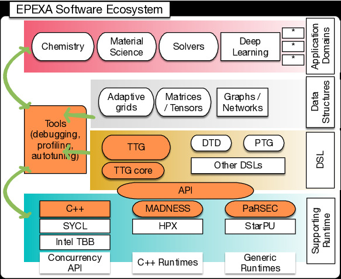

EPEXA is an NSF-supported R&amp;D project that will create a
        production-quality, general-purpose, community-supported, open-source
        software ecosystem that attacks the twin challenges of programmer
        productivity and portable performance for advanced scientific
        applications on modern high-performance computers. Of special interest
        are irregular and sparse applications that are poorly served by current
        programming and execution models.

The project addresses central challenges from modern computational
        science:
* Advances in predictive, high-fidelity simulation are characterized by
          increasingly irregular and dynamic computation (block sparse,
          low-rank, mixed representations, etc.).
* Ongoing technology trend in heterogeneous architectures with
          dynamically changing performance, and the need to increase concurrency
          at all scales.

EPEXA builds upon prior work performed by the TESSE (Task-based
        Environment for Scientific Simulation at Extreme Scale) project, and in
        particular aims to complete the design and provide robust implementation
        of TESSE's main C++ API, the Template Task Graph ([TTG](ttg/)) that provides a
        powerful data-flow programming model. Specific project aims include:

* To extend, complete, and harden the successful TESSE research
          prototype providing its first production quality implementation using
          a community-based, science-driven approach.
* To grow and support the user community, associated applications, and
          research use cases.
* To create a community to design, maintain, support and to grow EPEXA
          in the future.
* To transform the scalability of key parts of new and existing
          numerical simulation codes, including enabling the development of new
          DSLs by utilizing the API of the EPEXA runtime, and by migration paths
          for both applications and application programmers to follow.

### Our community and their driving applications: {#community}

* Robert Harrison
    - [IACS](http://www.iacs.stonybrook.edu/), [Stony Brook University](http://www.stonybrook.edu/)
    - multiresolution numerical analysis ([MADNESS](https://github.com/m-a-d-n-e-s-s/madness)) with applications to chemistry, material science, nuclear physics, and others.
    - dynamic programming algorithms

* Edward Valeev
    - [Department of Chemistry](http://www.chem.vt.edu/), [Virginia Tech](https://www.vt.edu/)
    - block-sparse tensor algebra ([TiledArray](https://github.com/ValeevGroup/tiledarray))

* George Bosilca and Thomas Herault
    - [ICL](http://www.icl.utk.edu/), [The University of Tennessee, Knoxville](http://www.utk.edu/)
    - parallel programming and runtime ([PaRSEC](http://icl.utk.edu/parsec/))  

* Scott Thornton 
    - [Gerber Technology](http://www.gerbertechnology.com)
    - geospatial AI

* Florian Bischoff
    - [Humboldt University, Berlin](https://bit.ly/2RZG2q0)
    - computational chemistry

* [Wolfgang Bangerth](https://www.math.colostate.edu/%7Ebangerth/)
    - Department of Mathematics, Colorado State University
    - [deal.II](https://www.dealii.org) open-source finite-element engineering and physics

* Mohammad Mahdi Javanmard
    - [Facebook Research](https://research.fb.com/)

* Poornima Nookala
    - [IACS](http://www.iacs.stonybrook.edu/), [Stony Brook University](http://www.stonybrook.edu/)
        
      
### EPEXA Software Ecosystem {#ecosystem}

### Presentations and other resources

NSF CSSI 2020 PI meeting [poster](https://figshare.com/articles/Poster_CSSI_EPEXA_2020_pdf/11796048)

### Funding {#funding}

The EPEXA project is supported by the National
                              Science Foundation under grants OAC-1931387 at
                              Stony Brook University, OAC1931347 at Virginia
                              Tech, and ACI-1450300 at the University of
                              Tennesse, Knoxville.

The TESSE project was supported by the National
                              Science Foundation under grants ACI-1450344 at
                              Stony Brook University, ACI-1450262 at Virginia
                              Tech, and OAC-1931384 at the University of
                              Tennesse, Knoxville.

<!--Content is written in [Markdown](https://learnxinyminutes.com/docs/markdown/).
-->
<!--
You can use HTML elements in Markdown, such as the comment element, and they won't
be affected by a markdown parser. However, if you create an HTML element in your
markdown file, you cannot use markdown syntax within that element's contents.
-->
